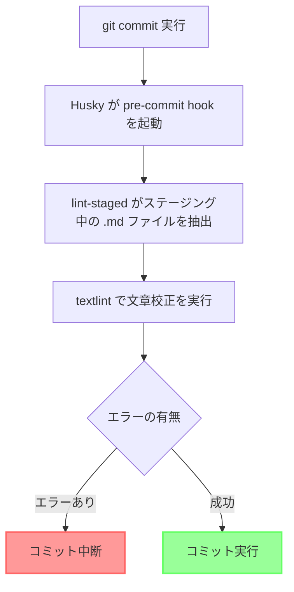

# ワークフロー

このリポジトリで使用している自動化ワークフローを説明する。

## Git コミット時の自動校正

コミット前に自動的に文章校正が実行される仕組みである。

## 関連する設定ファイル

| ファイル | 役割 |
|---------|------|
| `.husky/pre-commit` | pre-commit hook スクリプト（lint-staged を実行） |
| `package.json` の `lint-staged` | ステージングファイルに対する実行設定 |
| `.textlintrc.json` | textlint のルール設定 |

## 使用ツール

- **Husky**: Git hooks を簡単に管理するツール
- **lint-staged**: ステージング中のファイルのみを処理するツール
- **textlint**: 文章校正エンジン

## 参考リンク

- [husky](https://typicode.github.io/husky/)
- [lint-staged](https://github.com/okonet/lint-staged)
